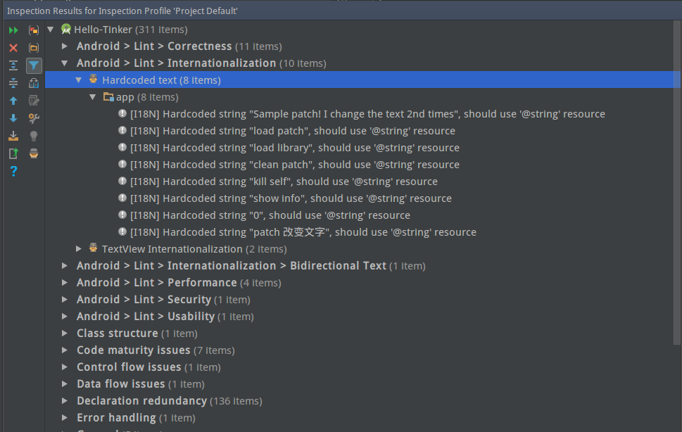
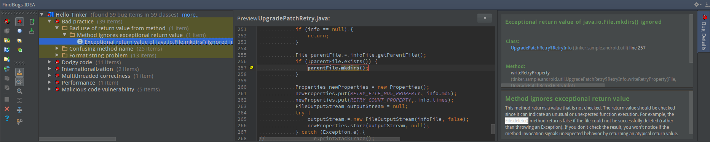

Android Lint
lint工具是一款代码检查工具，打包前运行lint检查代码，可以帮助我们发现很多不易觉察的问题
File——Settings——Editor——Inspections打开检查项设置窗口
点击Analyze——inspect code
然后根据提示的错误类型针对性修改

Android studio　findbugs插件
首先打开Android studio的设置中的插件，输入findbugs，如下图所示，点击Browse查找，选择findbugs－idea.
安装完毕之后重启Android studio，然后点击Analyze,发现有Findbugs这一选项，说明安装成功。
可以选择Analyze Project Files检查整个工程

